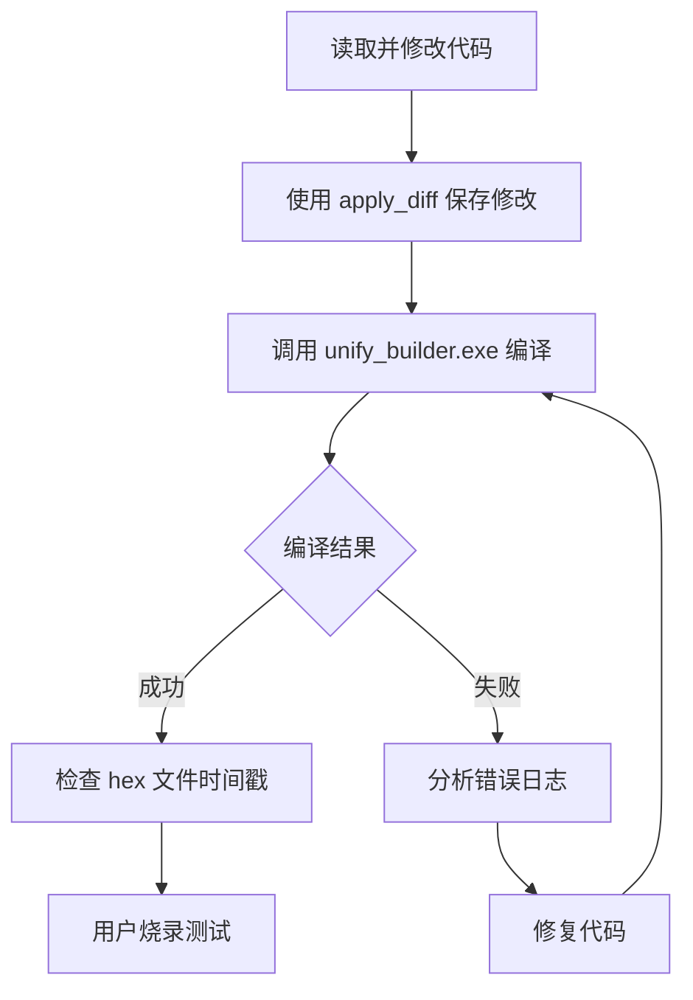

# EIDE 项目命令行编译指南

## 📖 背景

VS Code 的 Embedded IDE (EIDE) 扩展是一个强大的嵌入式开发工具，但它的编译功能通常只能通过 VS Code 界面（F7 快捷键）触发。本文档记录了如何通过命令行直接编译 EIDE 项目，使 AI 助手能够自动化完成代码修改和编译的完整流程。

---

## 🔍 探索过程

### 第一步：分析项目结构

首先，我查看了 EIDE 项目的配置目录：

```bash
list_files .eide
```

发现了三个关键文件：
- `eide.yml` - 项目主配置文件
- `env.ini` - 环境变量配置
- `files.options.yml` - 文件选项配置

### 第二步：查看 VS Code Tasks 配置

读取 `.vscode/tasks.json` 文件：

```json
{
    "version": "2.0.0",
    "tasks": [
        {
            "label": "build",
            "type": "shell",
            "command": "${command:eide.project.build}",
            "group": "build"
        }
    ]
}
```

发现 `${command:eide.project.build}` 是 VS Code 命令，无法直接在命令行调用。

### 第三步：发现 builder.params 文件

在 `build/test_demo/` 目录下发现了 `builder.params` 文件，这是一个 JSON 格式的编译参数文件，包含：

```json
{
    "name": "test_demo",
    "toolchain": "AC5",
    "toolchainLocation": "D:\\KEIL\\MDK\\ARM\\ARMCC",
    "sourceList": ["../test_demo/APP/key_app.c", ...],
    "incDirs": [".", "../test_demo/Core/Inc", ...],
    "defines": ["USE_HAL_DRIVER", "STM32G431xx"],
    "env": {
        "EIDE_BUILDER_DIR": "c:\\Users\\peng\\.vscode\\extensions\\cl.eide-3.26.1\\res\\tools\\win32\\unify_builder"
    }
}
```

### 第四步：找到构建工具

从 `env` 字段中发现了关键信息：

```
EIDE_BUILDER_DIR: c:\Users\peng\.vscode\extensions\cl.eide-3.26.1\res\tools\win32\unify_builder
```

这指向了 EIDE 扩展内置的 `unify_builder.exe` 工具。

---

## ✅ 最终解决方案

### 编译命令格式

```bash
<EIDE_BUILDER_DIR>\unify_builder.exe -p <项目路径>\build\<项目名>\builder.params
```

### 具体命令示例

```bash
c:\Users\peng\.vscode\extensions\cl.eide-3.26.1\res\tools\win32\unify_builder\unify_builder.exe -p d:\Users\peng\Desktop\keil51\STM32\CODE\lanqiao\1210\test_demo_eide\build\test_demo\builder.params
```

### 命令组成部分

| 组件 | 路径 | 说明 |
|------|------|------|
| 构建工具 | `c:\Users\<用户名>\.vscode\extensions\cl.eide-<版本>\res\tools\win32\unify_builder\unify_builder.exe` | EIDE 扩展内置的构建工具 |
| 参数文件 | `<项目路径>\build\<项目名>\builder.params` | 包含所有编译配置的 JSON 文件 |

---

## 🛠️ 使用方法

### 方法一：使用 Desktop Commander MCP 工具

```javascript
<use_mcp_tool>
<server_name>desktop-commander</server_name>
<tool_name>start_process</tool_name>
<arguments>
{
  "command": "c:\\Users\\peng\\.vscode\\extensions\\cl.eide-3.26.1\\res\\tools\\win32\\unify_builder\\unify_builder.exe -p d:\\Users\\peng\\Desktop\\keil51\\STM32\\CODE\\lanqiao\\1210\\test_demo_eide\\build\\test_demo\\builder.params",
  "timeout_ms": 60000,
  "shell": "cmd"
}
</arguments>
</use_mcp_tool>
```

**重要提示：** 必须使用 `"shell": "cmd"` 参数，因为 PowerShell 对路径和参数的处理方式不同，会导致命令失败。

### 方法二：获取编译输出

使用 `read_process_output` 获取编译结果：

```javascript
<use_mcp_tool>
<server_name>desktop-commander</server_name>
<tool_name>read_process_output</tool_name>
<arguments>
{
  "pid": <进程ID>,
  "timeout_ms": 30000
}
</arguments>
</use_mcp_tool>
```

---

## 📋 编译输出解析

成功的编译输出示例：

```
[ INFO ] start building at 2025-12-15 23:10:36

[ TOOL ] Component: ARM Compiler 5.06 update 6 (build 750)

[ INFO ] file statistics (incremental mode)
+---------+-----------+-----------+---------------+--------+
| C Files | Cpp Files | Asm Files | Lib/Obj Files | Totals |
+---------+-----------+-----------+---------------+--------+
| 1       | 0         | 0         | 0             | 1      |
+---------+-----------+-----------+---------------+--------+

[ INFO ] start compiling ...
>> [100%] CC '../test_demo/APP/key_app.c'

[ INFO ] start linking ...
Program Size: Code=18468 RO-data=5128 RW-data=100 ZI-data=1396

[ INFO ] start outputting files ...
>> output hex file		[done]
file path: "build/test_demo/test_demo.hex"

[ DONE ] build successfully !, elapsed time 0:0:0
```

### 关键信息解读

| 输出内容 | 含义 |
|----------|------|
| `[ DONE ] build successfully !` | 编译成功 |
| `CC '../test_demo/APP/key_app.c'` | 被重新编译的文件 |
| `file path: "build/test_demo/test_demo.hex"` | 生成的 hex 文件路径 |
| `exit code 0` | 进程正常退出 |

---

## ⚠️ 注意事项

### 1. 增量编译问题

EIDE 使用增量编译，如果修改了文件但编译器没有检测到变化，需要手动删除对应的 `.o` 文件：

```bash
del /f "<项目路径>\build\<项目名>\.obj\__\test_demo\APP\key_app.o"
```

或者查看编译日志确认文件是否被重新编译：

```javascript
<use_mcp_tool>
<server_name>desktop-commander</server_name>
<tool_name>read_file</tool_name>
<arguments>
{
  "path": "<项目路径>/build/<项目名>/unify_builder.log",
  "offset": -20
}
</arguments>
</use_mcp_tool>
```

### 2. 路径格式

- Windows 路径使用双反斜杠 `\\` 或单正斜杠 `/`
- 路径中不要有中文字符
- 使用绝对路径更可靠

### 3. Shell 选择

| Shell | 推荐 | 原因 |
|-------|------|------|
| cmd | ✅ 推荐 | 兼容性最好 |
| PowerShell | ❌ 不推荐 | 对参数处理方式不同，容易出错 |

### 4. 确认编译结果

编译后检查 hex 文件的修改时间：

```javascript
<use_mcp_tool>
<server_name>desktop-commander</server_name>
<tool_name>get_file_info</tool_name>
<arguments>
{
  "path": "<项目路径>/build/<项目名>/<项目名>.hex"
}
</arguments>
</use_mcp_tool>
```

---

## 📁 相关文件说明

| 文件 | 路径 | 作用 |
|------|------|------|
| `eide.yml` | `.eide/eide.yml` | EIDE 项目主配置 |
| `builder.params` | `build/<项目名>/builder.params` | 编译参数（自动生成） |
| `unify_builder.log` | `build/<项目名>/unify_builder.log` | 编译日志 |
| `<项目名>.hex` | `build/<项目名>/<项目名>.hex` | 烧录文件 |
| `<项目名>.axf` | `build/<项目名>/<项目名>.axf` | 调试文件 |

---

## 🔄 完整工作流程



---

## 💡 进阶技巧

### 获取 EIDE 版本路径

EIDE 扩展安装路径格式：
```
c:\Users\<用户名>\.vscode\extensions\cl.eide-<版本号>\
```

可以通过读取 `builder.params` 文件中的 `env.EIDE_BUILDER_DIR` 获取准确路径。

### 批量编译

如果需要强制重新编译所有文件，可以删除整个 `.obj` 目录：

```bash
rmdir /s /q "<项目路径>\build\<项目名>\.obj"
```

然后重新执行编译命令。

---

## 📝 总结

通过分析 EIDE 项目的配置文件，我们发现了 `unify_builder.exe` 这个命令行构建工具。它读取 `builder.params` 配置文件，调用 ARM 编译器完成编译任务。这使得 AI 助手能够：

1. ✅ 自动修改代码
2. ✅ 自动执行编译
3. ✅ 自动检查编译结果
4. ✅ 分析并修复编译错误

唯一需要用户手动完成的是烧录和调试，因为这需要硬件连接。

---

*文档创建时间：2025-12-15*
*适用于：EIDE v3.26.1 + ARM Compiler 5 (AC5)*