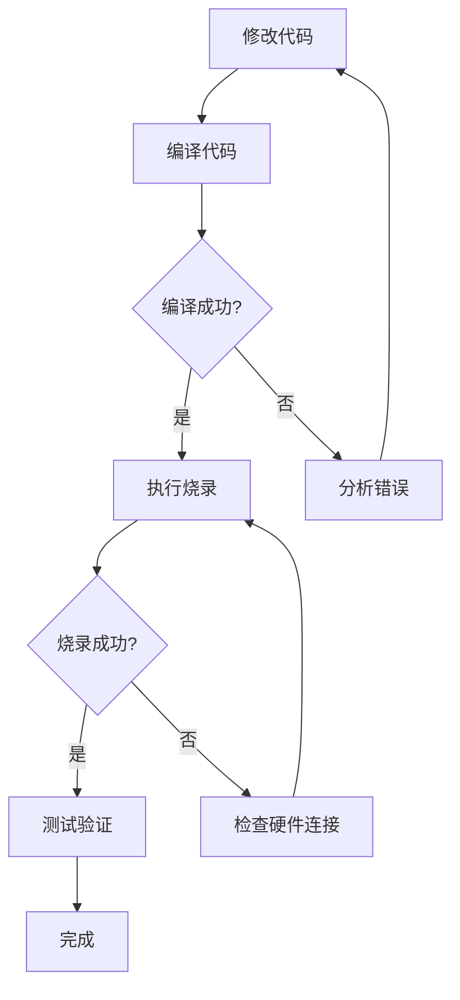

# OpenOCD 命令行烧录指南

## 📖 背景

在成功实现命令行编译后，下一步是实现自动化烧录。本文档记录了如何使用 OpenOCD 通过命令行烧录 STM32 程序，使 AI 助手能够完成从代码修改到烧录的完整自动化流程。

---

## 🔍 探索过程

### 第一步：分析项目烧录配置

首先查看 `.eide/eide.yml` 配置文件中的烧录相关配置：

```yaml
uploadConfigMap:
  OpenOCD:
    baseAddr: "0x08000000"
    bin: ""
    interface: cmsis-dap
    target: stm32g4x
uploader: OpenOCD
```

**发现：**
- 烧录工具：OpenOCD
- 调试接口：CMSIS-DAP
- 目标芯片：stm32g4x
- 基地址：0x08000000

### 第二步：查找 OpenOCD 安装路径

使用 `where` 命令查找 OpenOCD：

```bash
where openocd
```

输出：
```
C:\Users\peng\.eide\tools\OpenOCD-20250710-0.12.0\bin\openocd.exe
```

**发现：** EIDE 将 OpenOCD 安装在 `~/.eide/tools/` 目录下。

### 第三步：尝试直接命令行烧录

尝试使用 `-c` 参数直接传递烧录命令：

```bash
openocd -f interface/cmsis-dap.cfg -f target/stm32g4x.cfg -c "program xxx.hex verify reset exit"
```

**问题：** Windows CMD 的引号处理导致命令解析失败。

### 第四步：创建烧录脚本文件

为避免命令行引号问题，创建 `flash.cfg` 脚本文件：

```tcl
# OpenOCD flash script for STM32G4
init
reset halt
flash write_image erase build/test_demo/test_demo.hex
reset run
shutdown
```

### 第五步：成功烧录

使用脚本文件进行烧录：

```bash
cd /d <项目目录> && openocd -f interface/cmsis-dap.cfg -f target/stm32g4x.cfg -f flash.cfg
```

---

## ✅ 最终解决方案

### 方案一：使用脚本文件（推荐）

1. **创建 `flash.cfg` 文件**（放在项目根目录）：

```tcl
# OpenOCD flash script for STM32G4
init
reset halt
flash write_image erase build/test_demo/test_demo.hex
reset run
shutdown
```

2. **执行烧录命令**：

```bash
cd /d <项目目录> && openocd -f interface/cmsis-dap.cfg -f target/stm32g4x.cfg -f flash.cfg
```

### 方案二：使用 MCP 工具

```javascript
<use_mcp_tool>
<server_name>desktop-commander</server_name>
<tool_name>start_process</tool_name>
<arguments>
{
  "command": "cd /d d:\\Users\\peng\\Desktop\\keil51\\STM32\\CODE\\lanqiao\\1210\\test_demo_eide && openocd -f interface/cmsis-dap.cfg -f target/stm32g4x.cfg -f flash.cfg",
  "timeout_ms": 30000,
  "shell": "cmd"
}
</arguments>
</use_mcp_tool>
```

**重要：** 必须使用 `"shell": "cmd"` 参数！

---

## 📋 烧录输出解析

成功的烧录输出示例：

```
Open On-Chip Debugger 0.12.0 (2025-07-10) [https://github.com/sysprogs/openocd]
Licensed under GNU GPL v2
libusb1 d52e355daa09f17ce64819122cb067b8a2ee0d4b

Warn : DEPRECATED: auto-selecting transport "swd". Use 'transport select swd' to suppress this message.
Info : CMSIS-DAP: SWD supported
Info : CMSIS-DAP: JTAG supported
Info : CMSIS-DAP: FW Version = 1.0
Info : CMSIS-DAP: Interface Initialised (SWD)
Info : SWCLK/TCK = 1 SWDIO/TMS = 1 TDI = 1 TDO = 1 nTRST = 0 nRESET = 1
Info : CMSIS-DAP: Interface ready
Info : clock speed 2000 kHz
Info : SWD DPIDR 0x2ba01477
Info : [stm32g4x.cpu] Cortex-M4 r0p1 processor detected
Info : [stm32g4x.cpu] target has 6 breakpoints, 4 watchpoints
Info : [stm32g4x.cpu] Examination succeed
Info : [stm32g4x.cpu] starting gdb server on 3333
Info : Listening on port 3333 for gdb connections
[stm32g4x.cpu] halted due to debug-request, current mode: Thread 
xPSR: 0x01000000 pc: 0x080001ec msp: 0x200005d8
Info : device idcode = 0x20036468 (STM32G43/G44xx - Rev 'unknown' : 0x2003)
Info : RDP level 0 (0xAA)
Info : flash size = 128 KiB
Info : flash mode : single-bank
Warn : Adding extra erase range, 0x08005c90 .. 0x08005fff
shutdown command invoked
```

### 关键信息解读

| 输出内容 | 含义 |
|----------|------|
| `CMSIS-DAP: Interface ready` | 调试器连接成功 |
| `Cortex-M4 r0p1 processor detected` | 检测到目标芯片 |
| `device idcode = 0x20036468 (STM32G43/G44xx)` | 芯片型号确认 |
| `flash size = 128 KiB` | Flash 大小 |
| `Adding extra erase range` | Flash 擦除完成 |
| `shutdown command invoked` | 烧录完成并退出 |
| `exit code 0` | 操作成功 |

---

## ⚙️ 配置文件说明

### flash.cfg 脚本命令

| 命令 | 作用 |
|------|------|
| `init` | 初始化 OpenOCD 和调试接口 |
| `reset halt` | 复位并暂停 CPU |
| `flash write_image erase <file>` | 擦除 Flash 并写入程序 |
| `reset run` | 复位并运行程序 |
| `shutdown` | 关闭 OpenOCD |

### 接口配置文件

| 调试器类型 | 配置文件 |
|------------|----------|
| CMSIS-DAP | `interface/cmsis-dap.cfg` |
| ST-Link | `interface/stlink.cfg` |
| J-Link | `interface/jlink.cfg` |

### 目标芯片配置文件

| 芯片系列 | 配置文件 |
|----------|----------|
| STM32G4x | `target/stm32g4x.cfg` |
| STM32F4x | `target/stm32f4x.cfg` |
| STM32F1x | `target/stm32f1x.cfg` |
| STM32H7x | `target/stm32h7x.cfg` |

---

## ⚠️ 注意事项

### 1. Shell 选择

| Shell | 推荐 | 原因 |
|-------|------|------|
| cmd | ✅ 推荐 | 引号处理简单，兼容性好 |
| PowerShell | ❌ 不推荐 | 引号和路径处理复杂 |

### 2. 路径格式

- 使用正斜杠 `/` 或双反斜杠 `\\`
- flash.cfg 中的路径相对于项目根目录
- 建议使用相对路径

### 3. 硬件连接

- 确保调试器已正确连接到 PC 和开发板
- 检查开发板供电是否正常
- 某些调试器需要安装驱动（如 WinUSB）

### 4. 常见错误

| 错误信息 | 原因 | 解决方案 |
|----------|------|----------|
| `Error: unable to find CMSIS-DAP device` | 调试器未连接或驱动问题 | 检查连接，重新安装驱动 |
| `Error: flash write failed` | Flash 写保护或硬件问题 | 检查 RDP 级别 |
| `Error: timed out while waiting for target halted` | 目标芯片无响应 | 检查供电和连接 |

---

## 📁 相关文件

| 文件 | 路径 | 作用 |
|------|------|------|
| `openocd.exe` | `~/.eide/tools/OpenOCD-xxx/bin/` | OpenOCD 可执行文件 |
| `cmsis-dap.cfg` | `share/openocd/scripts/interface/` | CMSIS-DAP 接口配置 |
| `stm32g4x.cfg` | `share/openocd/scripts/target/` | STM32G4 目标配置 |
| `flash.cfg` | 项目根目录 | 自定义烧录脚本 |
| `test_demo.hex` | `build/test_demo/` | 编译生成的程序文件 |

---

## 🔄 完整自动化流程



### 完整命令序列

```bash
# 1. 编译
c:\Users\peng\.vscode\extensions\cl.eide-3.26.1\res\tools\win32\unify_builder\unify_builder.exe -p d:\Users\peng\Desktop\keil51\STM32\CODE\lanqiao\1210\test_demo_eide\build\test_demo\builder.params

# 2. 烧录
cd /d d:\Users\peng\Desktop\keil51\STM32\CODE\lanqiao\1210\test_demo_eide && openocd -f interface/cmsis-dap.cfg -f target/stm32g4x.cfg -f flash.cfg
```

---

## 💡 进阶技巧

### 1. 验证烧录

在 flash.cfg 中添加 `verify` 命令：

```tcl
init
reset halt
flash write_image erase build/test_demo/test_demo.hex
verify_image build/test_demo/test_demo.hex
reset run
shutdown
```

### 2. 只擦除不编程

```tcl
init
reset halt
flash erase_sector 0 0 last
shutdown
```

### 3. 读取 Flash 内容

```tcl
init
reset halt
dump_image dump.bin 0x08000000 0x10000
shutdown
```

### 4. 解锁读保护

如果芯片开启了读保护（RDP），需要先解锁：

```tcl
init
reset halt
stm32g4x unlock 0
shutdown
```

**警告：** 解锁会擦除全部 Flash！

---

## 📝 总结

通过分析 EIDE 的配置和 OpenOCD 的使用方法，我们成功实现了命令行烧录。关键步骤：

1. ✅ 从 `eide.yml` 获取烧录配置（接口、目标芯片）
2. ✅ 使用 `where openocd` 找到 OpenOCD 路径
3. ✅ 创建 `flash.cfg` 脚本避免命令行引号问题
4. ✅ 使用 CMD shell 执行烧录命令

现在 AI 助手可以完成完整的开发流程：
1. ✅ 修改代码
2. ✅ 编译代码
3. ✅ 烧录程序
4. ⏳ 用户测试验证

---

*文档创建时间：2025-12-15*
*适用于：OpenOCD 0.12.0 + CMSIS-DAP + STM32G4*